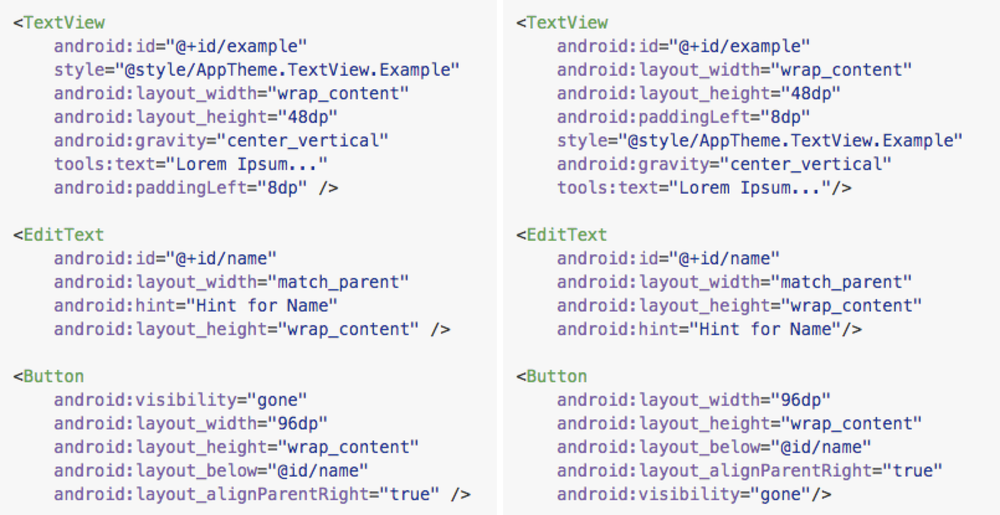

# XmlArrangement - Android

* XML Arrangement Rules Generator for Android CodeStyle

---

## Before/After



## How to use?

### 1) Create a file to describe your desired order: (empty lines are ignored)

```txt
xmlns:android
xmlns:.*

android:id
android:name

android:layout_width
android:layout_height
android:minWidth
android:minHeight

android:.*
.*
```

See [example.txt](example.txt)

### 2) Run:

```
user@machine:~$ xmlarrangement-android my-order.txt > rules.xml
```

### 3) Install:

* Android Studio **>** Preferences **>** CodeStyle **>** Scheme **>** Manage **>** Export

* Open exported file and rename your scheme, e.g. `<code_scheme name="NewScheme">`

* Find the line `<codeStyleSettings language="XML">`

* You should see a structure like this:
```xml
    <arrangement>
      <rules>
        ...
      </rules>
    </arrangement>
```

* Replace the content inside `<rules></rules>` with the content of `rules.xml`

* Copy new file to Android Studio codestyle path:
 * **Mac**: ~/Library/Preferences/AndroidStudioX.X/config/codestyles/
 * **Linux**: ~/.AndroidStudioX.X/config/codestyles/
 * **Windows**: %USERPROFILE%\\.AndroidStudioX.X\config\codeStyles

* Restart AndroidStudio, go to Preferences **>** CodeStyle **>** Scheme and apply `NewScheme`.


## Installation

- Simple, using PyPI:

```
user@machine:~$ [sudo] pip install xmlarrangement-android
```

- or download the source and:

```
user@machine:~$ [sudo] python setup.py install
```


## References

* [Formatting xml layout files for Android](https://medium.com/@VeraKern/formatting-xml-layout-files-for-android-47aec62722fc#.bt8shn2qx)
